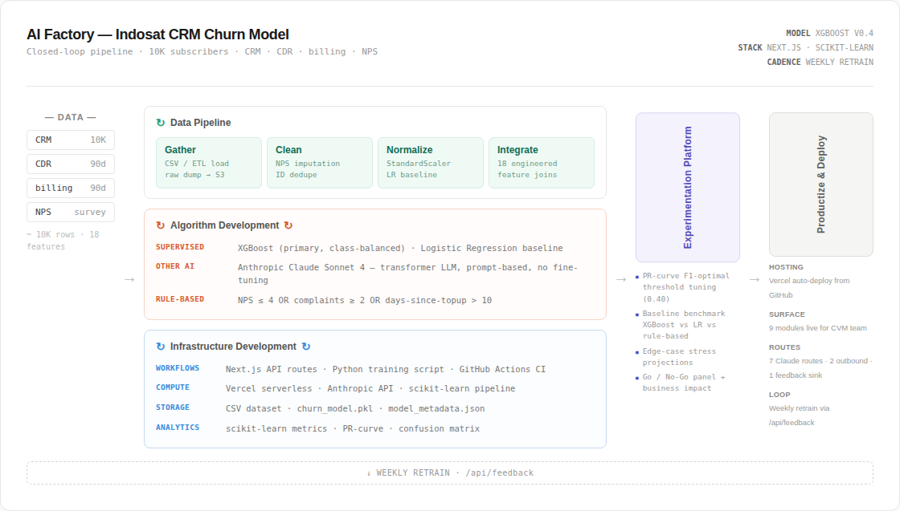
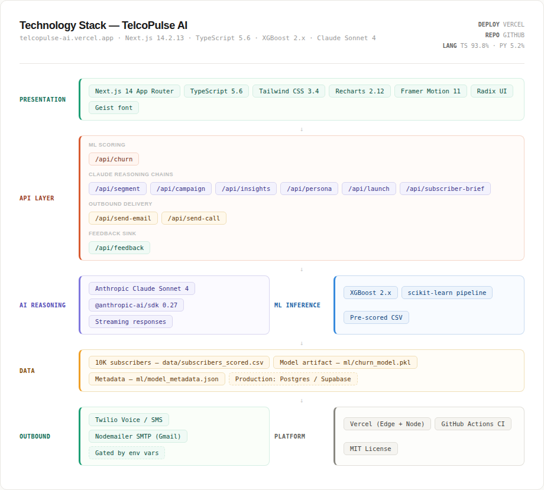

<div align="center">

# 📡 TelcoPulse AI

### Marketing intelligence for subscription businesses — built by someone who managed it at scale.

**[Live Demo](https://telcopulse-ai.vercel.app)** · **[Report](docs/Report.md)** · **[Architecture](#architecture)** · **[Modules](#what-it-does)** · **[Quick start](#quick-start)**


</div>

---

## Why this exists

Most AI marketing tools are built by engineers guessing at what marketers need.

I spent 10 years in the trenches:
- **Indosat Ooredoo Hutchison** — Led pricing & bundling for 100M+ subscribers ($119M monthly data revenue)
- **Smartfren Telecom** — Built retention campaigns that lifted retention by 70%
- **Hutchison 3 Indonesia** — Drove product operations for an app with 10M+ downloads
- **Grab (GrabKios)** — Built lifecycle campaigns contributing 80%+ of company revenue

TelcoPulse is the tool I wished existed every Monday morning, staring at 10 dashboards that didn't talk to each other.

## What it does

Nine modules, one platform, one shared subscriber dataset:

| # | Module | Tag | What it does |
|---|---|---|---|
| 1 | 🧠 **Churn Radar** | ML-POWERED | XGBoost model scores every subscriber on 18 behavioral features. Returns risk + the *reason* each one might churn. |
| 2 | 👤 **Subscriber Workflow** | HUMAN-IN-THE-LOOP + AI BRIEF | Per-subscriber retention tracker with a 4-step flow: AI Scored → Reviewed → Contacted → Outcome. One click generates a Claude brief (risk narrative + recommended channel/offer + personalized email + voice script). Three differentiated decision paths after review: **Approve AI** (standard send) · **Escalate** (channel auto-pinned to voice + senior-agent banner) · **Mark Safe** (model false-positive override — contact step skipped, outcome auto-set, false-positive notes guided). All paths submit through `/api/feedback` to close the retraining loop. |
| 3 | 🎯 **Smart Segments** | NATURAL LANGUAGE | Type "high-value postpaid with declining usage" → Claude turns it into SQL filters, runs it, and suggests a campaign angle. |
| 4 | ⚡ **Campaign Writer** | MULTI-CHANNEL | One brief, four channels. SMS (160 char), push, email, WhatsApp — all on-brand, tone-adjustable, compliance-aware. |
| 5 | 📊 **Impact Predictor** | FORECASTING | Before you hit send, Claude estimates reach, conversion, and revenue using telecom benchmarks and your segment data. |
| 6 | 🎚️ **What-If Simulator** | INTERPRETABILITY | Drag sliders on subscriber features and watch churn probability move in real time. Makes the model legible. |
| 7 | 📋 **Model Evaluation** | GO / NO-GO | Full eval suite: metrics, baseline comparison, business-impact estimate, edge cases, and an AI factory architecture view. |
| 8 | 🪪 **Persona Architect** | ICP GENERATOR | Claude generates a full Ideal Customer Profile from a product + industry — summary, pains, goals, channels, lifecycle. Falls back to a deterministic template when no API key is set. |
| 9 | 🚀 **Launch Copilot** | GTM STRATEGY | Claude generates positioning, taglines, messaging pillars, a phased plan, and a budget-allocated channel mix conditioned on product, audience, and budget. Same template fallback. |

## Architecture



End-to-end flow: data sources → ingestion + feature engineering → model layer (XGBoost + LR + rule-based baselines) → per-subscriber scoring → Next.js API → Claude Sonnet 4 for generative tasks → dashboard activation → outbound (Twilio + SMTP) → human-in-the-loop feedback → weekly retraining.



Layered stack: typed React frontend, Next.js API routes, hybrid AI layer, CSV-backed data plus serialized model artifact, optional outbound integrations, Vercel hosting.

<details>
<summary>Text version of the architecture (for accessibility)</summary>

```
┌─────────────────────────────────────────────────┐
│  Frontend Layer                                 │
│  Next.js 14 App Router · TypeScript · Tailwind  │
│  Recharts · Framer Motion · Geist · Radix UI    │
└──────────────────┬──────────────────────────────┘
                   │
┌──────────────────┴──────────────────────────────┐
│  API Layer (Next.js route handlers)             │
│  7 Claude routes:                                │
│   /api/churn  /api/segment  /api/campaign       │
│   /api/insights  /api/persona  /api/launch      │
│   /api/subscriber-brief                         │
│  2 outbound routes:                              │
│   /api/send-email  /api/send-call               │
│  1 feedback sink:                                │
│   /api/feedback                                  │
└──────────────────┬──────────────────────────────┘
                   │
        ┌──────────┴──────────┐
        │                     │
┌───────┴────────┐   ┌────────┴──────────────────┐
│  AI Reasoning  │   │  ML Inference             │
│  Claude Sonnet │   │  XGBoost (joblib)         │
│  4 — multi-step│   │  18 features · ROC-AUC    │
│  chains via    │   │  0.73 · trained on 8K /   │
│  Anthropic SDK │   │  evaluated on 2K          │
└───────┬────────┘   └────────┬──────────────────┘
        │                     │
        └──────────┬──────────┘
                   │
┌──────────────────┴──────────────────────────────┐
│  Data Layer                                      │
│  10K synthetic SEA-telecom subscribers           │
│  CSV-backed; realistic prepaid/postpaid mix      │
└──────────────────────────────────────────────────┘
                   │
┌──────────────────┴──────────────────────────────┐
│  Outbound (optional)                             │
│  Twilio Voice · Nodemailer (Gmail SMTP)          │
└──────────────────────────────────────────────────┘
```

</details>

## Tech stack

- **Frontend:** Next.js 14 (App Router), TypeScript 5.6, Tailwind CSS, Recharts, Framer Motion, Radix UI, Geist font
- **AI:** Claude Sonnet 4 via `@anthropic-ai/sdk` (distinct reasoning chains per module)
- **ML:** XGBoost classifier, scikit-learn, pandas, numpy — model served via Python helper, metadata in `ml/model_metadata.json`
- **Integrations:** Twilio Voice (`/api/send-call`), Nodemailer over Gmail SMTP (`/api/send-email`) — already wired into the codebase, activated by env vars below; SMS / push / WhatsApp content is generated by the Campaign Writer but not auto-delivered
- **Deploy:** Vercel (Edge + Node runtime), GitHub Actions CI
- **Design:** Light theme, coral brand accent (a nod to Indosat), monochrome typography

## Quick start

```bash
# 1. Clone the repo
git clone https://github.com/mn3265-commits/telcopulse-ai.git
cd telcopulse-ai

# 2. Install dependencies
npm install

# 3. Set up environment variables
cp .env.example .env.local
# At minimum, set ANTHROPIC_API_KEY

# 4. Generate the synthetic dataset (one-time)
python scripts/generate_dataset.py

# 5. Train the churn model (one-time)
python scripts/train_model.py

# 6. Run the dev server
npm run dev
```

Open `http://localhost:3000` and click **Launch dashboard**.

### Environment variables

| Variable | Required | Purpose |
|---|---|---|
| `ANTHROPIC_API_KEY` | ✅ | Powers all Claude reasoning ([get one](https://console.anthropic.com)) |
| `TWILIO_SID` | optional | Twilio account SID — enables outbound voice via `/api/send-call` |
| `TWILIO_TOKEN` | optional | Twilio auth token |
| `TWILIO_PHONE_FROM` | optional | Twilio sender phone number |
| `GMAIL_ADDRESS` | optional | Gmail address for SMTP — enables retention email via `/api/send-email` |
| `GMAIL_APP_PASSWORD` | optional | Gmail app password (not your account password — generate one at myaccount.google.com → Security → App passwords) |

## The synthetic dataset

10,000 subscribers with realistic patterns from Southeast Asian telecom markets:

- **Plan types:** prepaid (73%) vs postpaid (27%) — matches real market split
- **Cities:** weighted by actual Indonesian demographics
- **Usage patterns:** correlated with age, plan type, and lifecycle stage
- **Churn signals:** based on real CVM experience — topup recency, complaints, NPS, dropped calls

This isn't random noise. Every signal is a churn predictor I actually used managing 100M subscribers.

## The ML model

```
Algorithm:    XGBoost Classifier (class-balanced, scale_pos_weight=3.03)
Features:     18 (behavioral + demographic)
Training:     80/20 stratified split (8K train · 2K test)
Threshold:    0.40 — tuned via PR-curve F1 maximization

Metrics @ tuned threshold
  ROC-AUC:    0.73
  Recall:     0.66
  Precision:  0.41
  F1:         0.50
  Accuracy:   0.68

Top feature importances
  1. NPS score                    0.17
  2. Complaints (last 90d)        0.09
  3. Days since last topup        0.08
  4. Plan type (prepaid vs post)  0.08
  5. Tenure (months)              0.06

Baseline comparison (same test set)
  XGBoost              AUC 0.73  P 0.41  R 0.66  F1 0.50
  Logistic Regression  AUC 0.72  P 0.39  R 0.66  F1 0.49
  Rule-based heuristic AUC 0.69  P 0.49  R 0.55  F1 0.52
```

Targets are recall-prioritized: in CVM, the cost of missing a churner is higher than the cost of contacting a stable subscriber. XGBoost wins on AUC (threshold-independent ranking quality), which gives the operator flexibility to retune the precision/recall trade-off at deployment time.

The Model Evaluation tab in the app surfaces these numbers alongside the confusion matrix, edge-case stress projections, business-impact estimate, and Go/No-Go assessment — the same artifact a CVM lead would expect before moving a model to production.

## Project layout

```
app/                # Next.js App Router (pages + route handlers)
  api/              # /churn, /segment, /campaign, /insights, /send-email, /send-call
  dashboard/        # Main product surface
components/         # Nine module components + shared UI primitives
lib/                # Shared helpers (Anthropic client, dataset loader, utils)
ml/                 # Trained model artifact + metadata (gitignored, regenerated)
scripts/            # Dataset generator + model trainer (Python)
data/               # Generated synthetic subscriber CSV
docs/
  Report.md         # 6-page AI Solution Design report
  Technical_Description.md   # 1-page technical brief
  DEPLOYMENT_GUIDE.md
  diagrams/         # Mermaid sources (.mmd) + rendered PNGs
notebooks/          # Exploratory notebooks
public/             # Static assets
```

## Documentation

- **[`docs/Report.md`](docs/Report.md)** — full 6-page report covering problem, AI factory design, technique justification, prototype, and Go/No-Go evaluation
- **[`docs/Technical_Description.md`](docs/Technical_Description.md)** — 1-page executive brief
- **[`docs/diagrams/`](docs/diagrams/)** — Mermaid `.mmd` sources and rendered PNGs for the AI factory pipeline and tech stack
- **[`docs/DEPLOYMENT_GUIDE.md`](docs/DEPLOYMENT_GUIDE.md)** — step-by-step Vercel deployment

To regenerate diagrams after editing `.mmd` sources:

```bash
npx -p @mermaid-js/mermaid-cli mmdc -i docs/diagrams/ai_factory.mmd \
  -o docs/diagrams/ai_factory.png -b transparent -w 1600 -H 900
```

## Deployment

Deploys to Vercel in one click:

[](https://vercel.com/new/clone?repository-url=https://github.com/mn3265-commits/telcopulse-ai)

Set `ANTHROPIC_API_KEY` in the Vercel project settings. Outbound channels (Twilio, SMTP) are optional — the app works fully without them.

A more detailed walkthrough lives in [`docs/DEPLOYMENT_GUIDE.md`](docs/DEPLOYMENT_GUIDE.md).

## Roadmap

- [x] Churn Radar with a real ML model
- [x] Natural language segmentation
- [x] Multi-channel campaign generation
- [x] Impact prediction
- [x] What-If simulator with live re-scoring
- [x] Model Evaluation suite (Go/No-Go)
- [x] Persona Architect (ICP generator)
- [x] Launch Copilot (GTM strategy)
- [ ] A/B test framework
- [ ] First-class webhook integrations (Twilio, SendGrid)
- [ ] Multi-tenant SaaS version
- [ ] Real database (Supabase / Postgres)

## About the author

**Mohammad Agung Nugroho** — currently pursuing a Master's at **Columbia University**.

10+ years across product, marketing, and CVM in telecom, e-commerce, and consulting. TelcoPulse is a portfolio project to demonstrate that domain expertise + modern AI/ML produces tools marketers actually want to use — not another wrapper around a chat box.

[LinkedIn](https://linkedin.com/in/mohagungnugroho) · [Email](mailto:mn3265@columbia.edu)

## License

MIT — fork it, build on it, make it yours.

---

<div align="center">

*Built with real CVM experience, served with real ML, powered by Claude.*

⭐ If this project helped you think about AI for marketing, give it a star.

</div>
